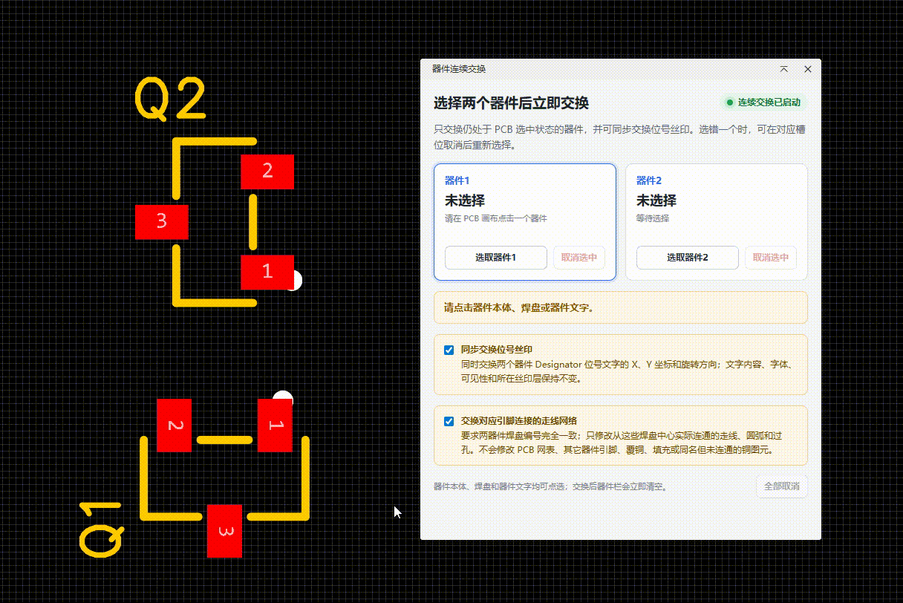

# 器件交换

嘉立创 EDA 专业版 PCB 扩展。交换窗口会显示“器件1”和“器件2”两个候选槽位；两个器件都处于 PCB 选中状态后，立即互换两者的 X、Y 坐标和旋转角度。默认同时交换两个器件 `Designator` 位号丝印的坐标和方向，并按相同焊盘编号，只交换从这些焊盘中心实际连通的走线、圆弧和过孔网络。每次成功后候选栏会可靠地清空并等待下一对。

## 功能演示



## 安装

1. 打开嘉立创 EDA 专业版。
2. V3：进入“高级 → 扩展管理器… → 导入”；V2：进入“设置 → 扩展 → 扩展管理器… → 导入扩展”。
3. 选择 `pin-to-pin-component-swap_v2.4.11.eext`。
4. 如果已经安装旧版，使用同一个文件直接更新；扩展 UUID 保持不变。
5. 在“已安装”列表中确认“器件交换”处于启用状态，然后重启编辑器一次。

## 连续交换

v2.4.11 使用 460×540 紧凑窗口，四个选项以两列排列；解释移至默认折叠的“选项说明”。

2.4.11 修复本机 EDA 创建弹窗时丢弃 x/y 参数的问题：窗口挂载后，仅定位包含本扩展 iframe 的窗口容器，移除宿主的居中偏移，并回读实际位置。最多执行两次启动定位，用户开始操作后停止，不持续吸附、不修改 EDA 安装文件。定位成功或失败均在日志框生成记录；未找到匹配窗口结构时安全跳过，交换功能不受影响。此兼容方式依赖宿主窗口结构，后续 EDA 版本可能需要调整。

2.4.8 兼容视口接口同步和异步返回，获取失败时尝试窗口或屏幕尺寸；全部失败会提示而非静默居中。日志中的 window-position-request 记录尺寸来源和请求坐标，不代表宿主已按坐标显示。若位置仍不正确，请先清除旧日志，关闭并重新打开窗口，再复制诊断日志。

窗口新打开时请求按截图布局靠右上方放置：右侧预留 328 像素面板，上方预留 136 像素工具栏区域，横坐标随 EDA 视口宽度计算。使用 CSS 像素，不额外乘屏幕缩放比例。仍可拖动窗口；恢复已打开的窗口保留手动位置。公开 API 无法读取可调整的面板边界，面板宽度或工具栏布局改变后可能需要手动微调。

2.4.11 在窗口定位完成前暂时隐藏本扩展弹窗，完成后显示；主脚本异常时 1.8 秒自动恢复。默认位置比上一版向左 48、向下 32 像素。

本版针对画布延迟覆盖选中状态增加有限重试，交换前仍校验实际选中状态；清空或选中无关图元时不会强行恢复选择。焊盘按事件中的图元 ID 优先查询父器件真实焊盘列表，兼容局部子 ID 与完整子 ID，不按位置或名称猜测归属。

### 复制报错日志

点击“清除日志”可清除当前记录及本地保存的旧报错；之后的新报错会重新记录。不会清除 PCB 或候选器件，也不会撤回已经复制到系统剪贴板的文本。

发生错误后，点击“复制报错日志”，将完整文本粘贴发给维护者。如果提示剪贴板受限，展开的日志会自动全选，按 Ctrl+C 即可。日志记录扩展版本、时间、错误信息、候选位号/图元 ID、点选事件、程序选择过程、实际选中 ID 和校验重试结果，最多保留最近 120 条操作记录。最新错误快照保存在本地扩展用户配置中，正常交换不会覆盖它，关闭并重新打开窗口后仍可复制；不自动上传。如果本地存储不可用，当次窗口内仍可复制。

本次更新用于收集偶发“未选中”错误的现场证据，不代表该偶发问题已彻底修复。

v2.4.3 增加两个独立勾选项，默认开启：“通过焊盘选择器件”和“通过器件丝印选择器件”。后者支持 EDA 明确关联到器件的位号/文字，不根据距离猜测独立文字的归属。取消某项后，该类型图元不能用于添加候选器件；直接选中器件本体始终有效。更改选项会清空候选栏，随后重新选取。

器件的选中状态按父器件及其子图元统一识别；兼容 EDA 返回焊盘或位号 ID 的情况。程序选择后的回读会做短暂重试；真正已取消选中的器件仍不会交换。“通过器件丝印选择器件”决定如何选取，“同步交换位号丝印”决定是否移动位号，两者独立。

1. 打开 PCB 文档。
2. 点击顶部菜单“器件交换 → 打开连续交换窗口...”。
3. 窗口出现后，在画布上点击第一个器件；它会显示在“器件1”槽位并保持选中。
4. 如果选错，可点击该槽位的“取消选中”，或点击“重新选取器件1”。
5. 点击第二个器件后，它会显示在“器件2”；系统确认两个候选器件都仍处于 PCB 选中状态后立即交换，不需要确认按钮。
6. 默认勾选“同步交换位号丝印”；不需要移动位号时，请在选择第二个器件前取消勾选。
7. 默认勾选“交换对应引脚连接的走线网络”。只想交换器件和位号的位置、方向时，请在选择第二个器件前取消勾选。
8. 每次交换完成会自动清空两个槽位；继续点击下一对即可重复交换。
9. 也可点击“选取器件1/器件2”指定下一次画布点击写入哪个槽位。
10. 关闭交换窗口，或点击菜单“停止并关闭交换窗口”，即可退出连续模式。

点选器件本体、焊盘或器件文字均可。扩展不注册任何键盘快捷键。

## 器件与位号丝印交换

扩展会互换：

- X 坐标；
- Y 坐标；
- 旋转角度。

开启“同步交换位号丝印”时，还会互换两个器件 `Designator` 属性图元的 X、Y 坐标、旋转角度、丝印层和镜像状态。位号文字内容、字体和显隐状态保持各自原值；缺少位号属性或位号已锁定时会在移动器件前停止并说明原因。

关闭网络同步时，允许不同封装、不同焊盘数量和不同板面的两个器件。物料信息、器件网络和已有走线不会被互换或移动。锁定器件无法修改，需要先解锁。

> v2.4.4 起，器件位置、旋转方向和所在板层一并互换；顶层与底层之间的器件翻面由 EDA 原生层接口完成。交换后请检查焊盘位置、方向、飞线和 DRC。失败回滚包含器件层及已开启同步的位号层、镜像状态。

v2.4.4 增加点选归属补查：事件缺少父器件 ID 时，读取实际选中图元的父关联；必要时使用器件焊盘和位号列表进行精确 ID 匹配。无器件归属的独立焊盘、文字不参与。扫描期间取消选中或切换选取代次，旧结果不会加入候选栏。

如果交换中任一步提交失败，扩展会尝试将两个器件、位号丝印和连接走线网络恢复到交换前的状态。

## 引脚连接走线网络同步

勾选“交换对应引脚连接的走线网络”时，扩展会先做完整校验，再执行交换：

- 两个器件的焊盘编号集合必须完全一致；
- 从每个对应焊盘中心通过 `getConnectedPrimitives(true)` 开始，只沿实际相邻的直线、圆弧和过孔查找连通走线链；
- 连通走线链中的图元必须与起始焊盘网络一致，且不能处于锁定状态；
- 对应引脚网络不同的时候，只成对修改这些连通走线图元的网络属性；
- 不按网络名称扫描全板，不修改同名但物理上未连通的铜图元；
- 不修改 PCB 网表、两个器件或其它器件的引脚、独立焊盘、折线、填充和覆铜。

任一校验不通过时，扩展不会移动器件，并会给出原因。此时可取消一个槽位重新选择，或关闭网络同步后只交换位置和方向。执行中任一步失败时，扩展会尝试恢复连通走线网络及两个器件的原位姿。

> 按要求，走线链另一端所连接的其它器件引脚不会改变，因此交换后可能出现远端引脚与走线网络不一致。正式工程请先保留副本；每次交换后必须运行 DRC，并检查飞线、网络类、差分对和等长约束。

## 从源码构建

需要 Node.js 20.17 或更高版本。

```powershell
npm.cmd ci
npm.cmd run lint
npm.cmd run build
```

生成的扩展包位于 `build/dist/`。

## 使用的扩展 API

- `SYS_IFrame.openIFrame()`：打开不遮挡 PCB 操作的持续交换窗口；
- `PCB_Event.addMouseEventListener()`：按顺序读取画布上的器件点选事件；
- `PCB_SelectControl.doSelectPrimitives()` 与 `getAllSelectedPrimitives_PrimitiveId()`：保持并验证两个候选器件的 PCB 选中状态；
- `PCB_PrimitiveComponent.get()`：读取被点选的器件；
- `setState_X()`、`setState_Y()`、`setState_Rotation()` 与 `done()`：提交器件的新位姿；
- `PCB_PrimitiveAttribute.getAll()`：读取器件关联的 `Designator` 位号属性；
- 位号属性的 `setState_X()`、`setState_Y()` 与 `setState_Rotation()`：同步交换位号丝印位姿；
- `IPCB_PrimitiveComponentPad.getConnectedPrimitives(true)`：从被交换器件的焊盘中心读取直接连接走线；
- 直线、圆弧和过孔的 `getAdjacentPrimitives()`：只沿实际铜连接查找完整走线链；
- 直线、圆弧和过孔的 `setState_Net()`：成对更新这些连接走线图元的网络；
- `PCB_Document.triggerCanvasUpdateCalculation()`：交换后刷新画布和飞线计算；
- `PCB_Event.removeEventListener()`：关闭窗口时结束连续点选。

v2.4.0 会在接收画布事件后再次核对 PCB 的实际选中集，并用选择代次使交换期间已排队的异步任务失效；交换成功后还会在结束路径再次强制清空候选栏，避免迟到的旧 `selected` 事件把上一对器件填回来。走线网络批量提交后会先刷新 PCB 计算，再以退避间隔重复读取确认；失败回滚会强制重写并校验全部原网络，避免 `done()` 后短暂读到旧值造成误判。

上述内联框架和 PCB 事件/图元修改接口包含 Beta API。正式工程使用前建议保留工程副本。

## 源代码仓库

- 主仓库：[GitHub](https://github.com/ly12121/jlc_extend)
- 国内镜像：[Gitee](https://gitee.com/li-yan-123/jlc_extend)
- 问题反馈：[GitHub Issues](https://github.com/ly12121/jlc_extend/issues)

## 许可证

Apache-2.0

## 作者

LIYAN
